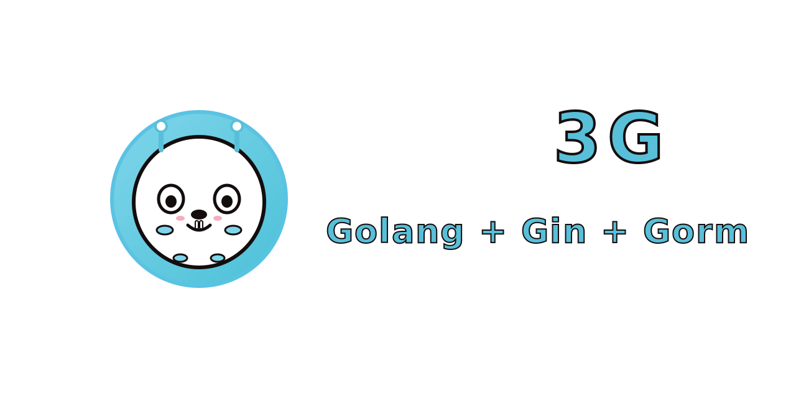
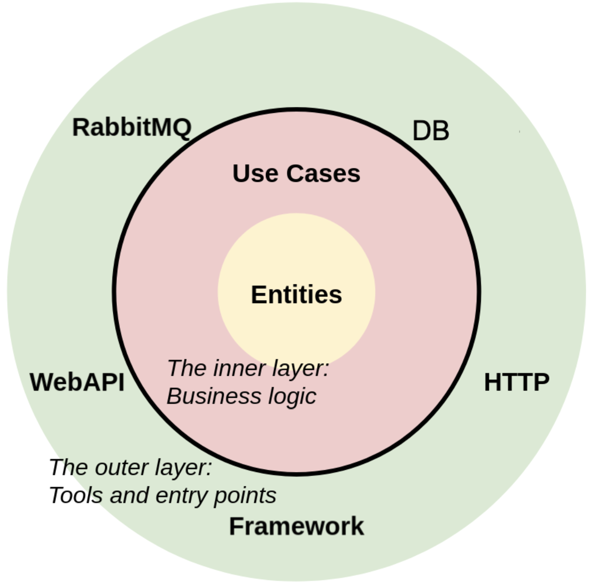
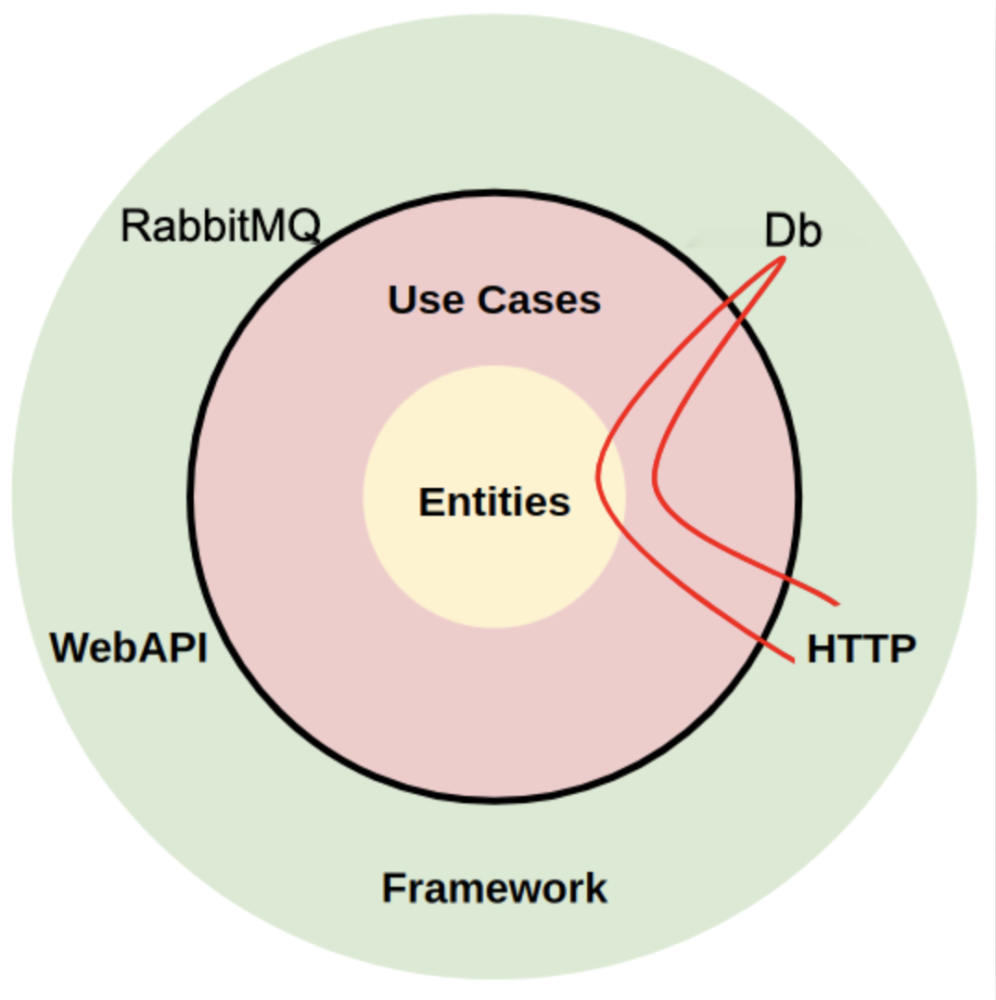

# Go Clean 模板（Golang + Gin + Gorm）

<p align="center">
    灵感来源于 <a href="https://github.com/evrone/go-clean-template" target="_blank">evrone/go-clean-template</a>
</p>

[🇺🇸 English](README.md)

Golang 服务的 Clean Architecture（整洁架构）模板

[](https://github.com/imbossa/3G/releases/)
[](https://github.com/imbossa/3G/blob/master/LICENSE)
[](https://goreportcard.com/report/github.com/imbossa/3G)

[](https://github.com/gin-gonic/gin)
[](https://gorm.io/)
[](https://github.com/swaggo/swag)
[](https://github.com/go-playground/validator)
[](https://github.com/goccy/go-json)
[](https://github.com/golang-migrate/migrate)
[](https://github.com/rs/zerolog)
[](https://github.com/stretchr/testify)
[](https://go.uber.org/mock)

## 概述

本模板旨在展示：

- 如何组织项目，避免代码变成“意大利面条”式混乱
- 如何存放业务逻辑，使其保持独立、整洁和可扩展
- 当微服务规模扩大时，如何不失去对代码的控制

采用了 Robert Martin（又名 Uncle Bob）提出的设计原则。

[3G](https://github.com/imbossa/3G) 由 [bossa](https://bossa.wang) 创建并维护。

本模板实现了三种类型的服务端：

- AMQP RPC（基于 RabbitMQ 作为 [传输层](https://github.com/rabbitmq/amqp091-go)）
- gRPC（基于 protobuf 的 [gRPC](https://grpc.io/) 框架）
- REST API（基于 [Gin](https://github.com/gin-gonic/gin) 框架）

## 目录

- [快速开始](#快速开始)
- [项目结构](#项目结构)
- [依赖注入](#依赖注入)
- [整洁架构](#整洁架构)

## 快速开始

### 本地开发

```sh
# 运行应用并自动迁移数据库
make run
```

### 构建

```sh
# 构建项目
make build
```

服务验证：

- REST API:
    - http://127.0.0.1:8080/healthz
    - http://127.0.0.1:8080/metrics
    - http://127.0.0.1:8080/swagger/index.html
- gRPC:
    - 地址: `tcp://127.0.0.1:8081`
    - [v1/translation.history.proto](docs/proto/v1/translation.history.proto)

## 项目结构

### `cmd/app/main.go`

配置和日志初始化，主函数随后会在 `internal/app/app.go` 中“继续”执行。

### `config`

Twelve-factor 应用将配置存储在环境变量中（通常简称为 `env vars` 或 `env`）。环境变量便于在不同部署间切换，无需更改代码；与配置文件不同，环境变量不太可能被意外提交到代码仓库；与自定义配置文件或如 Java System Properties 等机制不同，环境变量是跨语言、跨操作系统的标准。

配置示例：[config.go](config/config.go)

环境变量样例：[.env.example](.env.example)

[docker-compose.yml](docker-compose.yml) 使用 `env` 变量配置服务。

### `docs`

Swagger 文档，由 [swag](https://github.com/swaggo/swag) 库自动生成。
无需手动修改。

#### `docs/proto`

Protobuf 文件。用于为 gRPC 服务生成 Go 代码，也用于生成 gRPC 服务文档。无需手动修改。

### `integration-test`

集成测试。
以独立容器形式运行，和应用容器并行。

### `internal/app`

`app.go` 文件中总有一个 _Run_ 方法，用于“承接”主函数。

这里是所有核心对象的创建地。
依赖注入通过 "New ..." 构造函数实现（详见依赖注入）。
这种方式使应用能够分层（见 [依赖注入](#依赖注入)），让业务逻辑与其它层解耦。

随后启动服务端并在 _select_ 中监听信号，实现优雅退出。
若 `app.go` 过大，可拆分为多个文件。

如需大量注入，可用 [wire](https://github.com/google/wire) 工具。

`migrate.go` 用于数据库自动迁移。
如指定 _migrate_ 标签参数，则包含该文件。
例如：

```sh
go run -tags migrate ./cmd/app
```

### `internal/controller`

服务端 handler 层（MVC 控制器）。模板展示了 3 种服务端：

- AMQP RPC（以 RabbitMQ 为传输层）
- gRPC（基于 protobuf 的 [gRPC](https://grpc.io/) 框架）
- REST API（基于 [Gin](https://github.com/gin-gonic/gin) 框架）

服务端路由风格统一：

- handler 按业务领域分组（以公共基础分组）
- 每组有独立的路由结构体，其方法处理路径
- 业务逻辑结构体注入到路由结构体，由 handler 调用

#### `internal/controller/amqp_rpc`

简单的 RPC 版本控制。
如需 v2，只需添加 `amqp_rpc/v2` 目录，内容与 v1 相同。
并在 `internal/controller/amqp_rpc/router.go` 文件中添加：

```go
routes := make(map[string]server.CallHandler)
{
v1.NewTranslationRoutes(routes, t, l)
}
{
v2.NewTranslationRoutes(routes, t, l)
}
```

#### `internal/controller/grpc`

简单的 gRPC 版本控制。
如需 v2，添加 `grpc/v2` 目录，并在 `docs/proto` 目录下也添加 `v2` 目录。
在 `internal/controller/grpc/router.go` 文件中添加：

```go
{
v1.NewTranslationRoutes(app, t, l)
}
{
v2.NewTranslationRoutes(app, t, l)
}
reflection.Register(app)
```

#### `internal/controller/http`

简单的 REST 版本控制。
如需 v2，添加 `http/v2` 目录，并在 `internal/controller/http/router.go` 文件中添加：

```go
apiExampleGroup := app.Group("/example")
{
example.NewTranslationRoutes(apiV1Group, t, l)
}
apiV2Group := app.Group("/v2")
{
v2.NewTranslationRoutes(apiV2Group, t, l)
}
```

除了 [Gin](https://github.com/gin-gonic/gin)，也可使用其他 http 框架。

在 `router.go` 及 handler 方法上方有注释，用于 [swag](https://github.com/swaggo/swag) 生成 swagger 文档。

### `internal/entity`

业务逻辑实体（模型），可在任何层被复用。
也可包含方法，如校验等。

### `internal/usecase`

业务逻辑。

- 按业务领域（公共基础）分组
- 每组一个结构体
- 一文件一结构体

仓储、WebAPI、RPC 以及其他业务逻辑结构体通过依赖注入方式注入进来
（见 [依赖注入](#依赖注入)）。

#### `internal/repo/persistent`

仓储即业务逻辑操作的抽象存储（数据库）。

#### `internal/repo/webapi`

抽象 Web API，供业务逻辑调用。
比如其它微服务通过 REST API 提供服务。
包名可依据实际用途更改。

### `pkg/rabbitmq`

RabbitMQ RPC 模式：

- RabbitMQ 内部无路由
- 使用 fanout 类型交换机，绑定 1 个独占队列，是性能最优配置
- 自动重连

## 依赖注入

为消除业务逻辑对外部包的依赖，采用依赖注入。

例如通过 New 构造函数将依赖注入业务逻辑结构体，
使业务逻辑独立且可移植。
可在不修改 `usecase` 包代码的前提下替换接口实现。

```go
package usecase

import (
// 无外部依赖
)

type Repository interface {
	Get()
}

type UseCase struct {
	repo Repository
}

func New(r Repository) *UseCase {
	return &UseCase{
		repo: r,
	}
}

func (uc *UseCase) Do() {
	uc.repo.Get()
}
```

这样也便于自动生成 mock（如用 [mockery](https://github.com/vektra/mockery)）和编写单元测试。

> 不依赖具体实现，方便组件随时替换。只要新组件实现接口，业务逻辑无需改动。

## 整洁架构

### 核心思想

程序员只有在大部分代码写完后，才能意识到最优架构。

> 好的架构能让决策尽可能后置。

### 主要原则

依赖反转（SOLID 原则之一）即依赖注入原则。
依赖方向从外层指向内层，因此业务逻辑和实体不会依赖系统其它部分。

应用被拆为两层：内部层和外部层：

1. **业务逻辑**（Go 标准库）
2. **工具**（数据库、服务端、消息中间件、其它包和框架）



**内层**（业务逻辑）应保持纯净：

- 不引入外层包
- 仅用标准库功能
- 通过接口调用外层

业务逻辑无需了解 Postgres 或具体 Web API，
仅通过接口与“抽象”数据库或 Web API 交互。

**外层**有其它限制：

- 各组件互不感知。如何从一个工具调用另一个？不能直接，只能通过内层业务逻辑。
- 调用内层只能通过接口。
- 数据以业务逻辑方便的格式（`internal/entity`）传递。

例如，HTTP 控制器需要访问数据库，两者都属外层，互不知情，通信需经 usecase（业务逻辑）：

```
    HTTP > usecase
           usecase > repository (Postgres)
           usecase < repository (Postgres)
    HTTP < usecase
```

> 和 < 符号表示通过接口跨层。同下图：



或更复杂的业务逻辑：

```
    HTTP > usecase
           usecase > repository
           usecase < repository
           usecase > webapi
           usecase < webapi
           usecase > RPC
           usecase < RPC
           usecase > repository
           usecase < repository
    HTTP < usecase
```

### 各层


### Clean Architecture 术语

- **实体（Entities）**：业务逻辑操作的数据结构，存放于 `internal/entity`。MVC 术语中即为模型。
- **用例（Use Cases）**：业务逻辑，位于 `internal/usecase`。

业务逻辑直接操作的层，常称为 _基础设施层_，如仓储 `internal/usecase/repo`、外部 webapi `internal/usecase/webapi`、任何 pkg、其它微服务。
本模板中，_基础设施_包均位于 `internal/usecase` 下。

入口层命名可自定，常见有：

- controller（本模板用法）
- delivery
- transport
- gateways
- entrypoints
- primary
- input

### 附加层

经典
[Clean Architecture](https://blog.cleancoder.com/uncle-bob/2012/08/13/the-clean-architecture.html)
面向大型单体应用设计，分四层。

原始版本中外层再细分为两层，彼此也有依赖反转，均通过接口通信。

在复杂业务中，内层也可再分（接口分离）。

---

复杂工具可继续细分层级，但仅在确有必要时增加层次。

### 其它架构

除了 Clean architecture，还有 _Onion architecture_ 和 _Hexagonal_（端口与适配器）架构。
它们本质都基于依赖反转原则。
端口与适配器与 Clean Architecture 极为相似，区别主要在术语。

## 类似项目

- [https://github.com/evrone/go-clean-template](https://github.com/evrone/go-clean-template)
- [https://github.com/bxcodec/go-clean-arch](https://github.com/bxcodec/go-clean-arch)
- [https://github.com/zhashkevych/courses-backend](https://github.com/zhashkevych/courses-backend)
